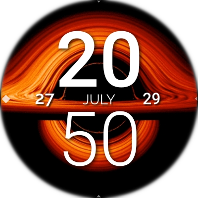

# Out of time

A `Live` Always-on-Display wallpaper. Only for [AsteroidOS](http://asteroidos.org/)



## How to install

Firstly you'll need to clone this repository:
```bash
git clone https://github.com/MagneFire/out-of-time.git
cd out-of-time
```
Then depending on the USB mode of your watch you can either chose to install using Developer or ADB mode.

To install using Developer mode use the command:
```bash
./push.sh
```

To install using ADB mode use the command:
```bash
./push.sh adb
```

## Credits

Animated black hole accretion disk taken from: https://svs.gsfc.nasa.gov/13326
